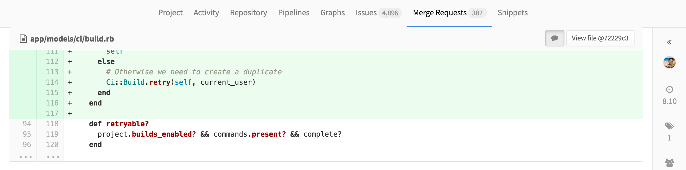

  chrome-gitlab-sticky-headers
========================


##About

Forked from [chrome-github-sticky-headers](https://github.com/danybony/chrome-github-sticky-headers), this implementation can be used on gitlab.com. Currently this is not in the Chrome extensions store.





##Development

You need to have NodeJS with `grunt-cli` installed.

```shell
$ npm install -g grunt-cli
$ npm install
```

To debug the application with a live reload mechanism, run:

```shell
$ grunt debug
```

Then add the `app` folder as an unpacked extension in Chrome.


##License

```
   Copyright 2015-2016 Daniele Bonaldo

   Licensed under the Apache License, Version 2.0 (the "License");
   you may not use this file except in compliance with the License.
   You may obtain a copy of the License at

     http://www.apache.org/licenses/LICENSE-2.0

   Unless required by applicable law or agreed to in writing, software
   distributed under the License is distributed on an "AS IS" BASIS,
   WITHOUT WARRANTIES OR CONDITIONS OF ANY KIND, either express or implied.
   See the License for the specific language governing permissions and
   limitations under the License.

```
